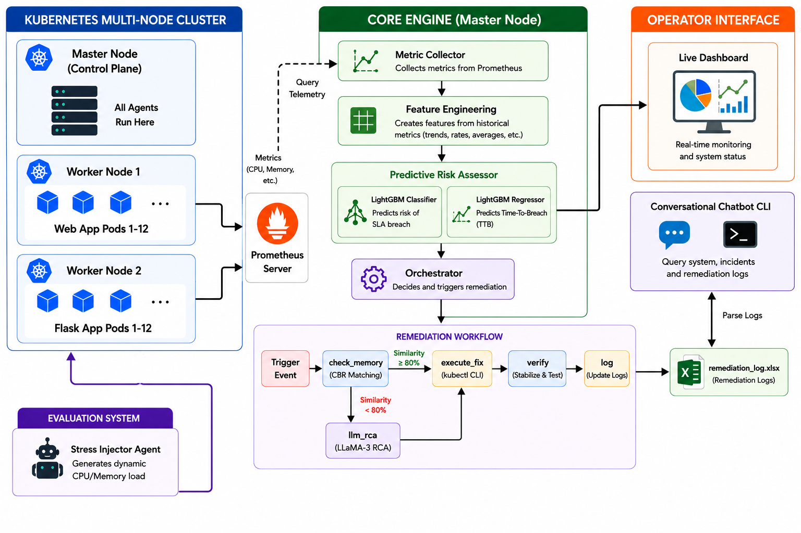

#  SAGE: Service Availability Guarantee Engine

**SAGE** is an autonomous, self-healing system for Kubernetes workloads designed to guarantee service availability and proactively prevent SLA/SLO breaches. By combining machine learning predictions, real-time Prometheus monitoring, episodic incident memory, and LLM-driven root-cause analysis (RCA), SAGE observes, diagnoses, and remediates system stress before it affects users.

---

## System Architecture



---

##  Key Features

- **Predictive Metric Monitoring**: Collects pod-level resource metrics (CPU/Memory) and utilizes pretrained LightGBM machine learning models to forecast:
  - **SLA Breach Probability** (Classifier)
  - **Estimated Time-To-Breach (TTB)** (Regressor)
- **LangGraph Self-Healing Agent**: An intelligent remediation pipeline implementing a state-graph workflow:
  - **Check Memory**: Looks up past incidents to see if a similar feature snapshot was successfully solved before.
  - **LLM Root Cause Analysis (RCA)**: If no matching past incident is found, uses LangChain and ChatGroq (`llama-3.1-8b-instant`) to diagnose the failure and select a remediation strategy.
  - **Execute Fix**: Integrates with the Kubernetes API using `kubectl` to apply the patch (e.g., scaling up replicas or increasing resource limits).
  - **Verify Outcome**: Evaluates resource state after remediation to verify recovery.
- **Episodic Memory (RAG-based Remediation)**: Avoids repetitive LLM calls by storing incident signatures in an episodic JSON database. Similarity is checked via **Cosine Similarity** on metrics and rate-of-change (ROC) features.
- **Automated Stress Injector**: An autonomous stress-testing agent that picks the healthiest pods and injects resource pressure (CPU spikes, memory leaks, compound workloads) to validate SAGE's self-healing capabilities.
- **Real-time Web Dashboard & Exporter**: 
  - Live Flask & Socket.IO web interface showing real-time resource utilization, predicted breach probabilities, and a system event feed.
  - Prometheus Metrics Exporter to publish internal SAGE health states directly to Prometheus.
- **Conversational SAGE Chatbot**: A terminal chatbot allowing platform engineers to interrogate SAGE about incident histories and remediation performance.

---

## Repository Structure

```
.
├── agents/
│   ├── chatbot_agent.py          # Terminal chatbot LangGraph configuration
│   ├── monitoring_agent.py       # Prometheus polling, ML inference & live-table console
│   ├── remediation_agent.py      # LangGraph workflow for RCA & kubectl execution
│   └── stress_injector.py        # LangGraph stress-testing pipeline
├── core/
│   ├── agent_events.py           # Structured event logging helpers
│   ├── chat_context.py           # Chat history management
│   ├── dashboard_server.py       # Flask + Socket.IO dashboard backend
│   ├── event_bus.py              # In-memory publish-subscribe event system
│   ├── feature_builder.py        # Features builder & metrics preprocessing
│   ├── incident_memory.py        # Incidents logging & analytics utilities
│   ├── k8s_helpers.py            # Kubernetes helper scripts & APIs
│   ├── llm_client.py             # ChatGroq LLM connector with fallbacks
│   ├── memory.py                 # Episodic database CRUD & cosine similarity
│   ├── ml_predict.py             # Machine learning prediction pipelines
│   ├── prometheus_client.py      # Prometheus metrics querying interface
│   ├── runtime_state.py          # Centralized thread-safe status monitor
│   ├── sage_config.py            # Configuration variables & environment mappings
│   └── sage_metrics_exporter.py  # Prometheus metric exporter
├── data/                         # Incident logs & episodic database (git-ignored)
├── k8s/                          # Kubernetes Deployment configurations
├── models/                       # Pre-trained ML classifiers & regressors
├── observability/                # Prometheus & Grafana configurations
├── scripts/                      # Validation & health-check scripts
├── .env                          # Configuration credentials
├── chatbot.py                    # Entry point for SAGE Chatbot
├── sage_orchestrator.py          # Entry point for SAGE Orchestrator
└── requirements.txt              # Project dependencies
```

---

## Getting Started

### 1. Prerequisites

- **Python**: Version 3.10+
- **Kubernetes Cluster**: A running cluster (e.g., Minikube) containing the target workloads (`web-app` / `flask-app`).
- **Prometheus**: Installed and scraping metric targets in your cluster (usually running on port `9090`).
- **Groq API Key**: Required for ChatGroq models.

### 2. Installation

Clone the repository and install the Python dependencies:

```bash
# Set up a virtual environment
python -m venv .venv
source .venv/bin/activate  # On Windows: .venv\Scripts\activate

# Install dependencies
pip install -r requirements.txt
```

### 3. Environment Variables Configuration

Create a `.env` file in the project root directory:

```ini
# Groq credentials for LLM actions
GROQ_API_KEY=your-groq-api-key

# Prometheus server address
SAGE_PROMETHEUS_URL=http://localhost:9090

# Target Kubernetes Namespace
SAGE_K8S_NAMESPACE=default

# Fallback resource check if Prometheus metrics are lagging
SAGE_USE_KUBECTL_TOP=1
```

---

## Running the Application

### 1. Launch SAGE Orchestrator
The orchestrator starts the web server, Prometheus exporter, monitoring loop, and stress injector loops:

```bash
python sage_orchestrator.py
```
Upon successful startup, the system will output the following services:
- **Live Web Dashboard**: [http://localhost:5050](http://localhost:5050)
- **Prometheus Exporter**: [http://localhost:9100/metrics](http://localhost:9100/metrics)
- **Chatbot Instruction**: `python chatbot.py`

### 2. Start the SAGE Chatbot
Interact with SAGE and query incident histories directly from your terminal:

```bash
python chatbot.py
```

### 3. Validate the Setup
To verify configurations, data files, and connections to Prometheus, Grafana, and the exporter:

```bash
python scripts/validate_e2e.py
```

---

## Configuration Reference

SAGE is fully customizable using environment variables. Below are the key configurations defined in [sage_config.py](core/sage_config.py):

| Variable Name | Default Value | Description |
|---|---|---|
| `GROQ_MODEL` | `llama-3.1-8b-instant` | Primary LLM used for Root Cause Analysis (RCA). |
| `SAGE_PROMETHEUS_URL` | `http://127.0.0.1:9090` | Endpoint of the Prometheus Server. |
| `SAGE_METRICS_PORT` | `9108` | Port where the Prometheus exporter runs. |
| `SAGE_MONITOR_REFRESH` | `20` | Interval (seconds) at which SAGE queries Prometheus. |
| `SAGE_VERIFY_SECONDS` | `90` | Wait duration (seconds) to verify if a remediation took effect. |
| `INJECTOR_BASE_INTERVAL` | `180` | Average interval (seconds) between stress injections. |
| `SAGE_USE_KUBECTL_TOP` | `0` | Set to `1` to fallback to `kubectl top` when Prometheus fails. |
